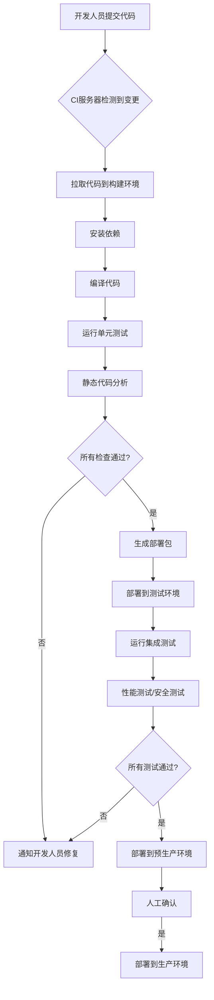

CI/CD（Continuous Integration/Continuous Delivery，持续集成/持续交付）是现代软件开发中的核心实践，通过自动化流程缩短从代码提交到部署的周期，提高软件质量和交付效率。以下从原理、工具链到实战实现，系统梳理CI/CD的关键知识点：


### **一、CI/CD核心概念与原理**
#### **1. CI（持续集成）**
- **定义**：开发人员频繁将代码合并到主干分支（如`main`），每次合并触发自动化构建和测试，尽早发现集成冲突。
- **核心目标**：
  - 快速反馈代码问题（如编译错误、单元测试失败）。
  - 避免"集成地狱"（多人代码长期不合并导致的大规模冲突）。
- **关键组件**：
  - **版本控制系统**（如Git）：代码存储与变更追踪。
  - **CI服务器**（如Jenkins、GitLab CI、GitHub Actions）：监听代码变更，触发构建流程。
  - **自动化测试**：单元测试、集成测试、静态代码分析（如ESLint、SonarQube）。

#### **2. CD（持续交付/部署）**
- **持续交付（Continuous Delivery）**：
  - 所有通过测试的代码可自动部署到预生产环境，但最终部署需人工确认。
  - 强调"随时可发布"的状态。
- **持续部署（Continuous Deployment）**：
  - 所有通过测试的代码自动部署到生产环境，无需人工干预。
  - 对自动化测试和监控要求极高（需确保零故障）。
- **核心目标**：
  - 减少手动操作，降低部署风险。
  - 快速验证功能，加速反馈循环。

#### **3. CI/CD工作流程**



### **二、CI/CD工具链**
#### **1. 版本控制与代码托管**
- Git + GitHub/GitLab/Bitbucket：存储代码并触发CI/CD流程。

#### **2. CI/CD平台**
- **Jenkins**：开源老牌工具，插件生态丰富，适合复杂自定义场景。
- **GitLab CI/CD**：与GitLab深度集成，配置简单（`.gitlab-ci.yml`）。
- **GitHub Actions**：GitHub官方工具，基于YAML配置，社区Action丰富。
- **CircleCI**：云原生CI/CD，支持并行执行，适合快速迭代。
- **AWS CodePipeline**/ **Azure DevOps**：云厂商提供的托管服务。

#### **3. 容器与编排**
- **Docker**：打包应用及其依赖为容器镜像。
- **Kubernetes**：容器编排，自动化部署、扩缩容。

#### **4. 测试工具**
- **单元测试**：Jest（JavaScript）、JUnit（Java）、pytest（Python）。
- **集成测试**：Selenium（UI测试）、Postman（API测试）。
- **静态分析**：ESLint（JavaScript）、Checkstyle（Java）、Pylint（Python）。

#### **5. 部署与基础设施**
- **基础设施即代码（IaC）**：Terraform、AWS CloudFormation。
- **配置管理**：Ansible、Chef、Puppet。


### **三、CI/CD实战实现（以GitHub Actions为例）**
#### **1. 项目结构示例**
```
my-project/
├── src/               # 源代码
├── tests/             # 测试代码
├── package.json       # 依赖配置（Node.js项目）
├── .github/
│   └── workflows/
│       └── ci-cd.yml  # GitHub Actions配置文件
```

#### **2. GitHub Actions配置示例（Node.js项目）**
```yaml
name: CI/CD Pipeline

on:
  push:
    branches:
      - main  # 仅主分支触发流程

jobs:
  build:
    runs-on: ubuntu-latest
    steps:
      - name: Checkout code
        uses: actions/checkout@v3  # 拉取代码
        
      - name: Set up Node.js
        uses: actions/setup-node@v3
        with:
          node-version: 18.x
          
      - name: Install dependencies
        run: npm ci
        
      - name: Run tests
        run: npm test
        
      - name: Build application
        run: npm run build
        
      - name: Upload artifact
        uses: actions/upload-artifact@v3
        with:
          name: build-artifact
          path: dist/  # 构建产物路径

  deploy-staging:
    needs: build
    runs-on: ubuntu-latest
    environment: staging
    steps:
      - name: Download artifact
        uses: actions/download-artifact@v3
        with:
          name: build-artifact
          
      - name: Deploy to staging
        uses: appleboy/ssh-action@v0.1.4  # 通过SSH部署
        with:
          host: ${{ secrets.STAGING_HOST }}
          username: ${{ secrets.STAGING_USER }}
          key: ${{ secrets.STAGING_KEY }}
          script: |
            cd /var/www/staging
            cp -r /tmp/build-artifact/* .
            docker-compose up -d

  deploy-production:
    needs: deploy-staging
    runs-on: ubuntu-latest
    environment: production
    if: github.ref == 'refs/heads/main'  # 仅主分支可部署生产
    steps:
      - name: Download artifact
        uses: actions/download-artifact@v3
        with:
          name: build-artifact
          
      - name: Deploy to production
        uses: appleboy/ssh-action@v0.1.4
        with:
          host: ${{ secrets.PRODUCTION_HOST }}
          username: ${{ secrets.PRODUCTION_USER }}
          key: ${{ secrets.PRODUCTION_KEY }}
          script: |
            cd /var/www/production
            cp -r /tmp/build-artifact/* .
            docker-compose up -d --scale app=3  # 生产环境扩容到3个实例
```

#### **3. 关键配置说明**
- **触发条件**：`on.push.branches` 指定监听 `main` 分支的提交。
- **工作流（Jobs）**：
  - **build**：构建和测试阶段，生成部署工件（artifact）。
  - **deploy-staging**：部署到测试环境，验证功能。
  - **deploy-production**：需人工确认后部署到生产环境。
- **环境变量**：通过 GitHub Secrets 管理敏感信息（如 SSH 密钥、服务器地址）。


### **四、CI/CD最佳实践**
#### **1. 测试策略**
- **测试金字塔**：
  - 底层：单元测试（快速、高覆盖率）。
  - 中层：集成测试（验证组件间协作）。
  - 顶层：端到端测试（模拟用户行为）。
- **测试执行顺序**：快测试优先（如单元测试），失败时立即终止流程。

#### **2. 部署策略**
- **蓝绿部署**：维护两个环境（蓝/绿），切换流量实现零停机。
- **金丝雀发布**：先将新版本部署到少量用户，验证稳定后逐步扩大。
- **滚动更新**：逐步替换旧版本实例，Kubernetes 原生支持。

#### **3. 监控与回滚**
- **部署后验证**：自动运行健康检查（如HTTP状态码、响应时间）。
- **自动回滚**：检测到问题时自动回退到上一版本（如通过Prometheus告警触发）。

#### **4. 安全与合规**
- **依赖扫描**：定期检查第三方依赖的安全漏洞（如Dependabot、Snyk）。
- **容器安全**：扫描Docker镜像（如Trivy、Clair）。
- **审计日志**：记录所有部署操作，满足合规要求。


### **五、CI/CD常见挑战与解决方案**
| **挑战**               | **解决方案**                                                                 |
|------------------------|------------------------------------------------------------------------------|
| 构建速度慢             | - 缓存依赖（如GitHub Actions的`actions/cache`）<br/>- 并行执行测试任务       |
| 测试不稳定             | - 修复脆弱测试（如避免依赖外部资源）<br/>- 隔离测试环境（如使用Docker容器）  |
| 环境差异导致的问题     | - 使用容器打包环境依赖<br/>- 统一开发/测试/生产环境配置                       |
| 部署失败回滚困难       | - 实现自动化回滚机制<br/>- 保留历史版本的部署包                               |
| 复杂系统的集成测试耗时 | - 使用测试替身（Mock）替代外部系统<br/>- 采用契约测试（Contract Testing）    |


### **六、CI/CD进阶技术**
1. **GitOps**：
   - 通过Git仓库作为"单一事实来源"管理基础设施和应用配置。
   - 工具：Argo CD、Flux CD。

2. **灰度发布**：
   - 基于用户特征（如地域、用户ID）将新版本逐步推送给部分用户。

3. **混沌工程**：
   - 在CI/CD流程中注入故障（如网络延迟、服务中断），测试系统韧性。


### **七、总结与备考建议**
1. **核心原理**：理解CI/CD的价值（快速反馈、质量保障、高效交付）及各阶段目标。
2. **工具链选择**：根据团队规模、技术栈选择合适的CI/CD平台（如GitHub Actions适合中小型团队）。
3. **实战经验**：动手搭建一个完整的CI/CD流程（如部署一个简单Web应用），熟悉配置语法和常见问题处理。
4. **面试应答技巧**：结合具体案例说明CI/CD实践（如"我们通过引入CI/CD，将部署频率从每周1次提升到每天10次"）。

通过系统化的CI/CD实践，团队可实现"代码即命令"的高效开发模式，大幅提升软件交付质量和速度。